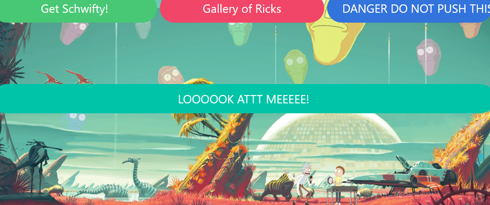
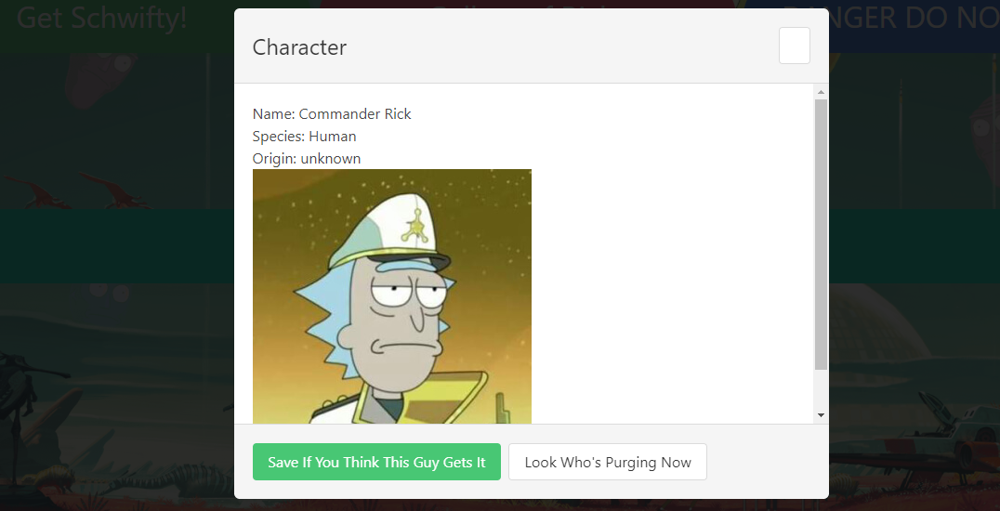
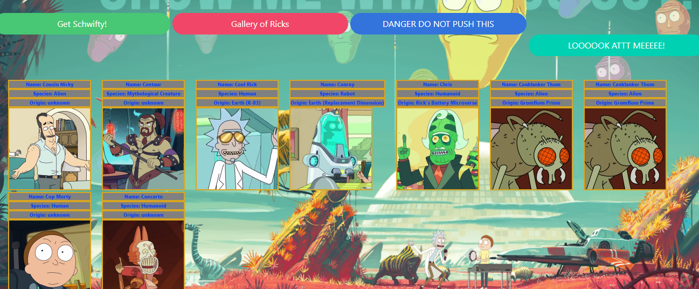
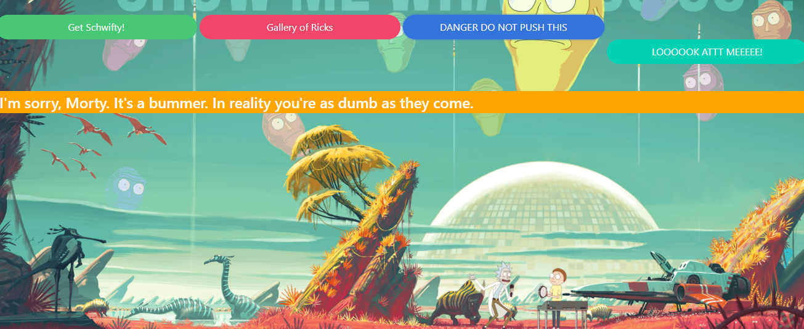

# Rick and Morty Get Schwifty App

[For deployed version, click me!!!](https://jlentz17.github.io/rick-and-morty-app/)

On the seventh week of bootcamp, we were given the assignment of creating a project with JavaScript and WEb API's.

# Description 

## User Story

AS A Rick and Morty fan 
I WANT to randomly generate a character card with its name, species, origin, and a picture 
SO THAT I can create a gallery of my favorite characters that are stored on the app 
I WANT to click a button that will display a random rick and morty quote 
SO THAT I can share it with my friends 

## Acceptance Criteria

GIVEN I am searching for Rick and Morty info 
WHEN I press the Search button 
THEN I am presented with a random character card with name, origin, species, and a picture and asked to save or next 
WHEN I press the save button 
THEN the character card is saved into local storage for the Gallery 
WHEN I press the cancel button 
THEN it exits the modal 
WHEN I press the Gallery button 
THEN the gallery of stored character cards is shown with the cards side by side 
WHEN I press the Quotes button 
THEN I am presented with a random Rick and Morty quote 
WHEN I press the sound board button 
THEN I am presented with a mp3 sound from a specific Rick and Morty character 

## Built With

* [Visual Studio Code](https://code.visualstudio.com/)
* [JavaScript](https://developer.mozilla.org/en-US/docs/Web/JavaScript)
* [CSS 3](https://developer.mozilla.org/en-US/docs/Web/CSS)
* [HTML 5](https://developer.mozilla.org/en-US/docs/Web/Guide/HTML/HTML5)
* [Markdown](https://markdownguide.org/cheat-sheet/)
* [Bulma](https://bulma.io/)
* [JQuery](https://code.jquery.com/)
* [Font Awesome](https://fontawesome.com/)
* [Rick and Morty Web API](https://rickandmortyapi.com/documentation)
* [Lorem Ricksum Web API](http://loremricksum.com/documentation/)

## Contributors

Jeremy Lentz   Brody Beebe   Ismael Espana Jr,   <jlentz17@gmail.com>   &copy; 2020 Jeremy Lentz, Brody Beebe, Ismael Espana Jr  All rights reserved.
